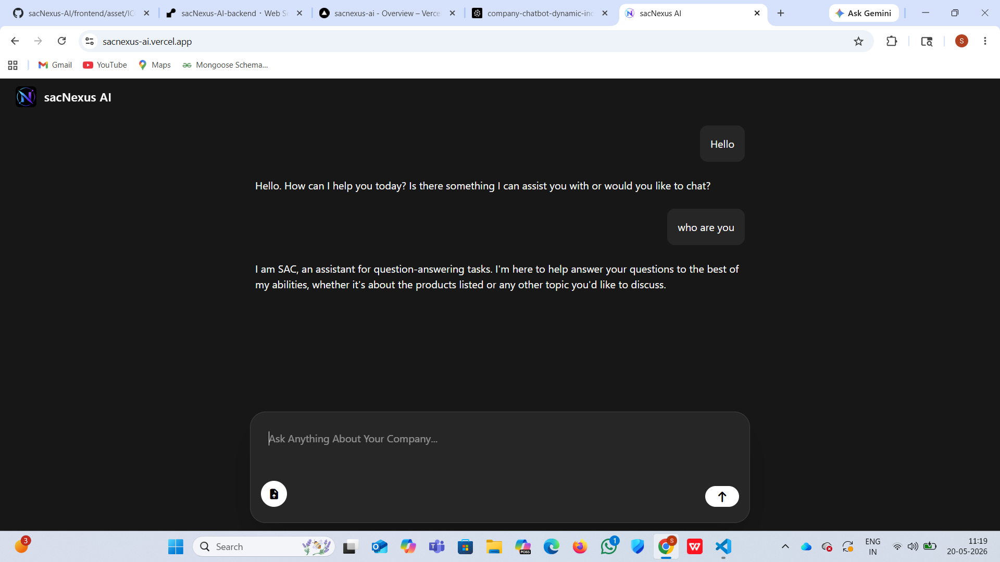

# sacNexus AI

AI-powered company chatbot that answers questions from dynamically uploaded PDF documents using RAG architecture.

---

## 🚀 Features

- Dynamic PDF Upload
- AI-Powered Question Answering
- RAG (Retrieval-Augmented Generation)
- Semantic Search using Pinecone
- OpenAI Embeddings
- Groq LLM Integration
- Modern Chat UI
- Real-time PDF Re-indexing

---

## 🚀 Live Demo

🔗 https://sacnexus-ai.vercel.app

---

## 📸 Screenshots



---

## 🛠️ Tech Stack

### Frontend
- HTML
- Tailwind CSS
- JavaScript

### Backend
- Node.js
- Express.js

### GenAI / RAG
- Groq API
- OpenAI Embeddings
- LangChain
- Pinecone Vector Database

---

## 📂 Project Structure

```bash
frontend/
backend/
```

---

## ⚙️ Installation

### Clone Repository

```bash
git clone https://github.com/KumarSachin-1016/sacNexus-AI.git
```

---

### Install Dependencies

#### Frontend

```bash
cd frontend
npm install
```

#### Backend

```bash
cd backend
npm install --legacy-peer-deps
```

---

## 🔑 Environment Variables

Create a `.env` file inside backend folder:

```env
OPENAI_API_KEY=your_openai_api_key
GROQ_API_KEY=your_groq_api_key
PINECONE_API_KEY=your_pinecone_api_key
PINECONE_INDEX_NAME=your_index_name
```

---

## ▶️ Run Project

### Start Backend

```bash
node server.js
```

### For Development

```bash
nodemon server.js
```

### Start Frontend

Run frontend using Live Server or any local server.

---

## 👨‍💻 Author

Sachin Kumar
